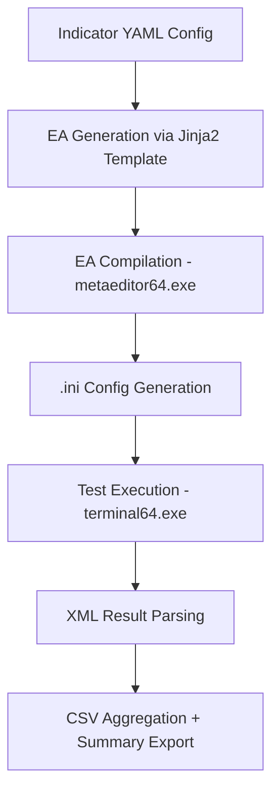

# MT5 Strategy Factory


This project is a Python-based framework for automating the strategy development lifecycle in MetaTrader 5 (MT5). It handles EA generation, compilation, configuration, batch testing, optimisation, and result evaluation — all in a structured, repeatable, and extensible way.

**MetaTrader 5 (MT5)** is a multi-asset trading platform widely used for developing and executing automated trading strategies. [Learn more](https://www.metatrader5.com/en)

While designed for trading automation, this project also demonstrates general software engineering practices such as:

- Clean Python architecture  
- CLI orchestration of external tools  
- Template-based code generation with Jinja2  
- XML parsing with custom handlers  
- File-based data pipelines  
- Modular, stage-based processing  
- Structured logging and output management  

## Key Features

- **Modular Optimisation Pipeline**: Stage-specific execution (Trigger, Confirmation, Volume, Exit, Baseline, etc.)
- **Dynamic EA Templating**: Generates `.mq5` files from YAML-based indicator configurations using Jinja2
- **MT5 CLI Integration**: Automates compilation and strategy testing via `metaeditor64.exe` and `terminal64.exe`
- **Structured Config Generation**: Produces `.ini` files per EA and test mode (IS/OOS), with precise parameter control
- **Robust XML Parsing**: Extracts results from MT5’s XML output using a custom SAX parser
- **Post-Processing Tools**: Aggregates results into sorted `.csv` files, exports summaries, and logs failed tests

## Use Cases

- Quantitative traders building indicator-based strategies  
- Developers testing EA variations in batch  
- Researchers optimising and comparing signal configurations  

## Pipeline Overview



## Requirements

- Python 3.8+
- MetaTrader 5 installed locally
- Access to your MT5 `Experts` directory

## Installation

Clone the repository and install the required Python dependencies:

```bash
git clone https://github.com/xMattC/meta-strategist.git
cd meta-strategist
pip install -r requirements.txt
```
⚠️ Important:
To enable EA compilation and testing within MetaTrader 5, this repository must be cloned into your MT5 Experts directory, for example:
- C:\Users\YOUR_USERNAME\AppData\Roaming\MetaQuotes\Terminal\YOUR_MT5_INSTANCE_ID\MQL5\Experts

## Configuration

Before running the pipeline, you must configure two key areas of the project:

### 1. MetaTrader 5 Paths

Update the hardcoded paths in `config/local_paths.yaml` to match your own MetaTrader 5 installation:

```yaml
# config/local_paths.yaml
# Replace the placeholders with your actual MetaTrader 5 paths

mt5_root: "C:/Users/YourUser/AppData/Roaming/MetaQuotes/Terminal/YOUR_TERMINAL_ID"

mt5_terminal_exe: "C:/Program Files/YourBroker MetaTrader 5/terminal64.exe"

mt5_meta_editor_exe: "C:/Program Files/YourBroker MetaTrader 5/metaeditor64.exe"
```
These paths are used to:
- Locate and compile `.mq5` files
- Run the MT5 Strategy Tester via command-line
- Access test cache, reports, and compiled EAs

### 2. EA Template Structure

By default, EA source files are generated using Jinja2 templates located in:

```
meta_strategist/generators/ea_templates/
```

These templates define how input variables, enums, buffers, and base conditions are inserted into `.mq5` files. Most users will need to adapt these templates to fit their own EA coding conventions, base classes, and project structure.


## Usage

### 1. Create Indicator YAML Files

Place them in `indicators/`. Each file defines inputs, buffer mappings, and optional enums and base conditions:

### 2. Run a Pipeline

```python
from strategy_factory.optimisation_pipeline import OptimizationPipeline
from strategy_factory.ini_generator import IniConfig
from strategy_factory.stages import get_stage

config = IniConfig(
    run_name="Apollo",
    start_date="2023.01.01",
    end_date="2023.12.31",
    period="D1",
    custom_criteria="ProfitFactor",
    symbol_mode="ALL",
    data_split="year",
    risk=0.02,
    sl=2,
    tp=1,
)

stage = get_stage("Trigger")
pipeline = OptimizationPipeline(config=config, stage=stage, recompile_ea=True)
pipeline.run_optimisation()
```

### This will:

1. Generate and compile EAs from YAML configurations using Jinja2 templates
2. Produce `.ini` files for in-sample (IS) testing
3. Iterate through each indicator and:
   - Run MT5 in-sample optimisation for the corresponding EA
   - Extract the optimal parameters from the results
   - Generate an out-of-sample (OOS) `.ini` file using those parameters
   - Run the OOS backtest and parse the results
   - Repeat until all indicators have been processed

### 3. Example Output

```
Outputs/{run_name}/{stage_name}/
├── experts/        ← Compiled EAs
├── ini_files/      ← In-sample and OOS .ini configs
├── results/        ← XML reports, combined CSVs
└── logs/           ← Per-stage log output
```
## Contributing

Contributions are welcome! Feel free to open issues or submit pull requests.