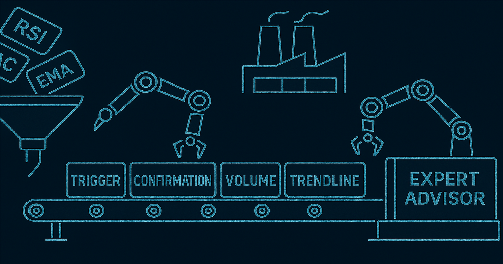

# MT5 Strategy Factory



**MetaTrader 5 (MT5)** is a multi-asset trading platform widely used for developing and executing automated trading 
strategies. [Learn more](https://www.metatrader5.com/en)

**MT5 Strategy Factory** is a powerful, production-grade Python framework for automating the complete lifecycle of 
strategy development in MetaTrader 5 (MT5). It enables modular strategy construction, batch optimisation, and performance 
evaluation — all driven by YAML indicator files and executed through a highly customisable, stage-based pipeline.

Whether you're a quantitative trader, algo developer, or strategy engineer, this framework lets you rapidly prototype, 
test, and refine trading strategies in a structured, repeatable, and scalable way.

## What It Does

MT5 Strategy Factory assembles full Expert Advisors (EAs) from modular indicator definitions using YAML, compiles them 
via MetaEditor, and batch-tests them using MT5’s Strategy Tester CLI.

The currently implemented system is a **trend-following pipeline** that:

1. Optimises all indicators for the **Trigger**
2. Then builds and evaluates the **Confirmation**
3. Adds a **Trendline structure** filter
4. Then applies a **Volume condition**
5. Finally integrates and tests the **Exit logic**

Each stage is independently scored using your chosen metric (e.g., Profit Factor), tested in-sample (IS), and then 
re-tested out-of-sample (OOS) to evaluate generalisation.

## Use Cases

- Quantitative developers building, testing, and refining modular strategies
- Algo researchers evaluating signal performance across time
- System traders seeking reproducible, automated backtesting workflows
- Fintech teams deploying walk-forward optimisations in high-frequency environments

## Requirements

- Python 3.8+
- MetaTrader 5 (installed and licensed locally)
- Access to your MT5 `Experts/` folder

## Installation

#### Step 1: Clone the Repository

Clone the repository to your local machine:

```bash
git clone https://github.com/xMattC/mt5-strategy-factory.git
cd mt5-strategy-factory
```

#### Step 2: Set Up a Virtual Environment

Create a virtual environment to manage dependencies e.g:

```bash
python -m venv .env
```

Activate the virtual environment:

- On Windows:
  ```bash
  .env\Scripts\activate
  ```
- On macOS/Linux:
  ```bash
  source .env/bin/activate
  ```

#### Step 3: Install Dependencies

Install the required dependencies:

```bash
pip install -r requirements.txt
```

Make sure to clone this repo directly into your MT5 Experts folder:

```
C:/Users/YourUser/AppData/Roaming/MetaQuotes/Terminal/YOUR_TERMINAL_ID/MQL5/Experts
```

## Configuration
Update the paths in ../mt5-strategy-factory/config/local_paths.yaml:
```yaml
mt5_root: "C:/Users/YourUser/AppData/Roaming/MetaQuotes/Terminal/YOUR_TERMINAL_ID"

mt5_terminal_exe: "C:/Program Files/YourBroker MetaTrader 5/terminal64.exe"

mt5_meta_editor_exe: "C:/Program Files/YourBroker MetaTrader 5/metaeditor64.exe"

strategy_factory_root: "C:/Users/YourUser/AppData/Roaming/MetaQuotes/Terminal/YOUR_TERMINAL_ID/MQL5/Experts/mt5-strategy-factory"
```

# MT5 Strategy Factory – Execution Guide

This guide describes the complete strategy execution flow in **MT5 Strategy Factory**, including how to use `main.py`, configure your strategy, and run the full trend-following pipeline using `run.py`.


The MT5 Strategy Factory is designed to run via a single entry point: `main.py`. This script bootstraps your strategy project, scaffolds the required files, and prepares everything needed to begin optimisation.

### What Happens When You Run `main.py`

1. A **project codename** is suggested using a generator.
2. If the user accepts (`Y`), a new project directory is created with:
   - `config.yaml` – strategy configuration
   - `whitelist.yaml` – list of tradable instruments
   - `run.py` – ready-to-execute pipeline script
3. The user can customise the generated config before running `run.py`.

---

### `run.py`: Stage Execution Script

This script orchestrates the execution of each logical strategy stage in order:

```python
StageRunner(...)               # Optimises the stage
create_stage_result_yaml(...) # Creates placeholder for indicator handoff
```

After each stage, the system halts until a user manually chooses the best-performing indicator to forward to the next stage.

A file like this must be created:

```
Outputs/{run_name}/{stage_name}/results/the_{stage_name}.yaml
```

Until this file exists, execution of the pipeline will pause.

**Note:** If a mistake is made, delete the `the_{stage}.yaml` file manually and rerun the helper script.

---

### config.yaml – Strategy Configuration

This YAML file contains all critical parameters for test configuration, including risk, time periods, and per-stage settings.

### Base Configuration Example

```yaml
run_name: example_run # Generated project name 
pipeline: trend_following # The name of the strategy pipeline to use (e.g., trend_following, mean_reversion)
whitelist_file: whitelist.yaml  # Path to the whitelist file. Use either "whitelist.yaml" or "CART_SYMBOL_ONLY"
start_date: 2016.01.01 # Optimisation/testing data start date (YYYY.MM.DD)
end_date: 2020.01.01 # Optimisation/testing data end date (YYYY.MM.DD)
period: D1 # Chart timeframe/period (e.g., D1 = daily, H1 = hourly)
main_chart_symbol: EURUSD # Main chart symbol for this run (not necessarily traded)
currency: USD # Base currency for trade account
deposit: 100000 # Initial deposit for the account (in currency units)
leverage: 100 # Account leverage (e.g., 100 = 1:100)
data_split: month # How to split the data for in-sample/out-of-sample (e.g., week, month, year)
risk: 2 # Default trade risk per position (as a percent of account, e.g., 2%)
sl: 1.5 # Default stop loss value (in ATR or custom units; pipeline-specific)
tp: 1 # Default take profit value (in ATR or custom units; pipeline-specific)
```

### Per-Stage Optimisation Settings

```yaml
opt_settings:
  Trigger:
    opt_criterion: 6       # 6 = Custom Max
    custom_criterion: 1    # Only used if opt_criterion = 6. (0=WIN_LOSS_RATIO, 1=WIN_PERCENT)
    min_trade: 100         # Minimum trades required for a valid solution
    max_iterations: 100    # Maximum optimisation params per indicator/ indicator param.

  Trendline:
    opt_criterion: 5
    custom_criterion: 99
    min_trade: 20
    max_iterations: 100
```

---

## whitelist.yaml – Symbol Universe

Defines tradable pairs or assets for testing:

```yaml
whitelist:
  - EURUSD
  - AUDNZD
  - EURGBP
  - AUDCAD
  - CHFJPY
```

Used during `.ini` generation to build config files for MT5’s strategy tester.

---

### How the Pipeline Works

Each stage is defined as a `stage_config` and is run in the following order:

1. **Trigger**
2. **Confirmation**
3. **Trendline**
4. **Volume**
5. **Exit**

Each stage:
- Loads indicators from YAML
- Compiles `.mq5` to `.ex5`
- Generates `.ini` strategy tester configs
- Runs MT5 via CLI
- Parses and scores XML result files
- Outputs CSV summaries and YAML metadata

---

### Indicator Selection Between Stages

After a stage completes, the user must:

1. Inspect:
   - `results/best_summary.csv`
   - `results/scored_results.csv`
2. Select a winning indicator
3. Use the helper:

```bash
python -m strategy_factory.post_processing.make_stage_result_file --indicator <name> --stage Trigger
```

This will create:

```
Outputs/{run_name}/{stage_name}/results/the_{stage_name}.yaml
```

This is **required** to continue the pipeline.

---

### Output Folder Layout

```
Outputs/
└── Apollo/
    ├── Trigger/
    │   ├── experts/
    │   ├── ini_files/
    │   ├── results/
    │   └── logs/
    ├── Confirmation/
    ├── Trendline/
    ├── Volume/
    └── Exit/
```


## Roadmap

- ✅ Trend-following pipeline complete
- 🔜 Breakout and mean-reversion pipelines
- 🔜 Indicator crossover detection
- 🔜 Parallelisation and distributed testing
- 🔜 Integrated visual reporting dashboard

### Contributing
Welcome contributions of all kinds — from new pipeline architectures and indicator modules to enhancements in the YAML 
configuration or templating system.  Feel free to fork the project and submit a pull request, or open an issue to start a discussion.

Note: Active development is currently maintained in a private repository.
If you're interested in collaborating more closely, please reach out.
