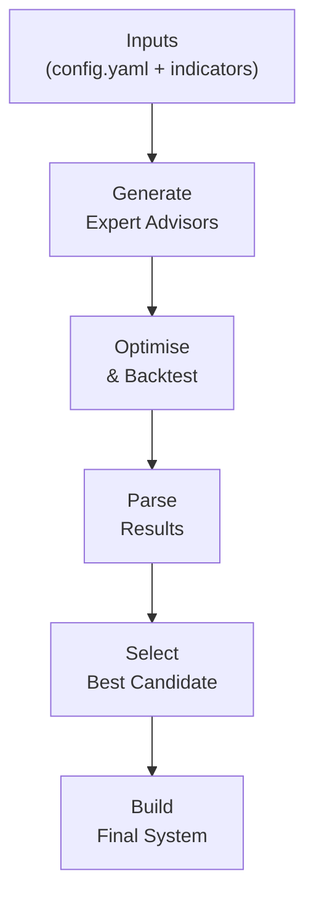

# MT5 Research Framework

A Python-based framework for automated generation, transformation and evaluation of modular strategy configurations.

The project focuses on workflow orchestration, configuration-driven architecture, automated processing pipelines, and research automation through reusable software components.

While the domain is quantitative strategy research, the primary engineering focus is on building scalable and maintainable software systems.


---

## 🧠 What This Project Builds

MT5 Strategy Factory generates MetaTrader 5 Expert Advisors (EAs) from YAML-defined trend-following components.

The framework progressively builds an Expert Advisor by independently evaluating and selecting:

- **Trigger** — the primary signal used to identify potential trade entries.
- **Confirmation** — a secondary signal used to reduce false positives.
- **Trendline** — a trend-direction component used to align trades with broader market movement.
- **Volume** — a market-quality filter used to avoid weak or unsuitable conditions.
- **Exit** — rules controlling how trades are closed.

Each stage:

- Generates EA source code
- Compiles MQ5 → EX5
- Generates MT5 tester configurations
- Executes optimisation/backtesting
- Parses and scores results
- Produces structured outputs

The project focuses primarily on workflow orchestration, automation, code generation, and configuration-driven processing.

---

## 🔍 Domain Context

MetaTrader 5 (MT5) is a multi-asset trading platform widely used for developing and executing automated trading strategies. [Learn more](https://www.metatrader5.com/en)

In this project, MT5 acts as the execution environment for optimisation and evaluation workflows, while the primary software focus is on orchestration, configuration management, and research automation.

---

## 🎯 Engineering Focus

This project was built to demonstrate:

- Configuration-driven application design
- Modular pipeline architecture
- Workflow orchestration
- Template-based code generation
- YAML validation and parsing
- External process automation
- Batch optimisation workflows
- Result processing pipelines
- Structured output generation
- Separation of concerns

---
## 🛠️ Tech Stack

- **Core:** Python
- **Data Processing:** Pandas, NumPy
- **Configuration Management:** YAML, PyYAML
- **Template Rendering:** Jinja2
- **External Integration:** MetaTrader 5 CLI
- **Architecture:** Modular pipeline design
- **Workflow Automation:** Batch optimisation pipelines
- **Result Processing:** XML parsing, CSV generation
- **Validation:** Structured configuration validation
- **Development:** Git, Pytest

---

## 🔑 Key Features

- Multi-stage optimisation pipelines
- YAML-driven strategy configuration
- Automatic Expert Advisor generation
- Automated MT5 compilation and execution
- In-sample / out-of-sample evaluation
- Result parsing and candidate scoring
- Stage-gated candidate progression
- Structured CSV/YAML outputs
- Modular workflow stages

---

## 🧱 Engineering Practices

This project evolved iteratively while exploring workflow automation and strategy research concepts. Development focused on improving maintainability and reducing complexity as the project grew.

Key practices include:

- Modular application design
- Separation of concerns
- Reusable software components
- Configuration-driven behaviour
- Validation layers
- Incremental refactoring and improvement
- Structured outputs for reproducibility

---
## 📈 System Architecture


```mermaid
flowchart TD

A["Inputs
(config.yaml + indicators)"]

B["Generate
Expert Advisors"]

C["Optimise
& Backtest"]

D["Parse
Results"]

E["Select
Best Candidate"]

F["Build
Final System"]

A --> B
B --> C
C --> D
D --> E
E --> F
```

The architecture separates configuration, orchestration, code generation, execution and result processing into independent components to improve maintainability and support repeatable workflows.

Full architecture details:

[Architecture Documentation](docs/architecture.md)

---

## 🔄 Processing Workflow

The currently implemented pipeline progressively builds complete systems using staged optimisation and evaluation.

Each stage:

- Loads YAML indicator definitions
- Generates Expert Advisor source code
- Compiles source into executable MT5 files
- Creates strategy tester configurations
- Executes optimisation workflows
- Parses and scores results
- Produces structured outputs
- Passes selected components to downstream stages

---

## 📂 Example Output Structure

```text
Outputs/
└── Example_Run/
    ├── Trigger/
    │   ├── experts/
    │   ├── ini_files/
    │   ├── results/
    │   │   ├── best_summary.csv
    │   │   ├── scored_results.csv
    │   │   └── the_trigger.yaml
    │   └── logs/
    │
    ├── Confirmation/
    ├── Trendline/
    ├── Volume/
    └── Exit/
```

---

## 📚 Additional Documentation

| Document | Description |
|-----------|-------------|
| [architecture.md](docs/architecture.md) | System architecture, component interactions, and design decisions |
| [configuration.md](docs/configuration.md) | YAML configuration system and parameter definitions |
| [execution-guide.md](docs/execution-guide.md) | End-to-end execution workflow and project lifecycle |
| [mt5-integration.md](docs/mt5-integration.md) | MT5 integration layer, INI generation, and CLI automation |
| [pipeline-workflow.md](docs/pipeline-workflow.md) | Progressive strategy construction and stage processing |

---

## ⚠ Current Limitations
Current limitations include:

- Limited automated test coverage
- Manual candidate selection between stages
- Local MetaTrader 5 dependency
- Windows-focused execution environment
- Single-machine execution workflow

Future development plans include expanded testing, improved reporting, and greater automation.

---

## 🚀 Future Improvements
- Expanded automated testing coverage
- Improved visualisation tooling
- Distributed execution support
- Additional processing pipelines
- Dashboard and reporting system
- Improved configuration tooling


## ⚙️ Installation

### Prerequisites

- Python 3.8+
- MetaTrader 5
- Git
- [MT5 Quant Lib dependency](https://github.com/xMattC/mt5-quant-lib)

### Clone Project

```bash
# This project must be cloned directly into your MetaTrader 5 `Experts` directory,
# `Terminal_ID` is generated automatically by MetaTrader 5 and differs between installations.
C:/Users/<YourUser>/AppData/Roaming/MetaQuotes/Terminal/<Terminal_ID>/MQL5/Experts/

# Clone repository:
git clone https://github.com/xMattC/mt5-strategy-factory.git
cd mt5-strategy-factory

# Create Virtual Environment
python -m venv .venv

# Activate environment
.venv\Scripts\activate

# Install Dependencies
pip install -r requirements.txt
```

### Install MT5 Quant Lib

``` Bash
# The dependency libuary must be installed into the MT5 `Include` directory.
C:/Users/<YourUser>/AppData/Roaming/MetaQuotes/Terminal/<Terminal_ID>/MQL5/Include/

# clone suporting libuary
git clone https://github.com/xMattC/mt5-quant-lib.git MyLibs
```

### Run

[execution-guide.md](execution-guide.md)


## ⚠ Disclaimer

This project was developed for research, experimentation, and software engineering purposes.

The generated strategies and outputs are intended to demonstrate workflow automation, optimisation pipelines, and system design concepts. They should not be interpreted as financial advice or used as a basis for investment decisions without independent evaluation.
