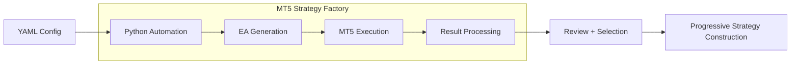

# MT5 Strategy Factory

A Python-based framework for automated generation, transformation and evaluation of modular strategy configurations.

The project focuses on workflow orchestration, configuration-driven architecture, automated processing pipelines, and research automation through reusable software components.

While the domain is quantitative strategy research, the primary engineering focus is on building scalable and maintainable software systems.

---

## 🔍 Domain Context

MetaTrader 5 (MT5) is a multi-asset trading platform widely used for developing and executing automated trading strategies. [Learn more](https://www.metatrader5.com/en)

In this project, MT5 acts as the execution environment for optimisation and evaluation workflows, while the primary software focus is on orchestration, configuration management, and research automation.

---

## 🎯 Engineering Focus

This project was built to demonstrate:

- Configuration-driven application design
- Modular pipeline architecture
- Workflow orchestration and automation
- YAML validation and parsing
- Automated code generation
- External process orchestration
- Batch optimisation workflows
- Structured output generation
- Research workflow automation
- Separation of concerns and reusable components

---

## 🛠️ Tech Stack

- **Language:** Python
- **Configuration:** YAML
- **Data Processing:** Pandas
- **Architecture:** Modular pipelines
- **Automation:** MT5 CLI integration
- **Validation:** Custom validation framework
- **Development:** Git

---

## 🔑 Key Features

- Multi-stage optimisation pipelines
- YAML-driven strategy and indicator configuration
- Automatic Expert Advisor (EA) generation
- Automated MT5 compilation and execution workflows
- Batch optimisation and evaluation
- In-sample / out-of-sample testing support
- Parameter extraction and result scoring
- Stage-gated candidate progression
- Structured outputs and result tracking
- Modular processing stages

---

## 🧱 Engineering Practices

This project evolved iteratively while exploring workflow automation and strategy research concepts. Development focused on improving maintainability and reducing complexity as the project grew.

Key practices include:

- Modular application design
- Separation of concerns
- Reusable software components
- Configuration-driven behaviour
- Validation layers
- Incremental refactoring and improvement
- Structured outputs for reproducibility

---
## 📈 Architecture

A key focus of this project was designing a staged processing pipeline capable of progressively constructing and evaluating systems while maintaining repeatable workflows.


```mermaid
flowchart LR

A["YAML Config"] --> B["Python Automation"]

subgraph B2["MT5 Strategy Factory"]

B --> C["EA Generation"]
C --> D["MT5 Execution"]
D --> E["Result Processing"]

end

E --> F["Review + Selection"]
F --> G["Progressive Strategy Construction"]
```

This architecture provides:

- Independent stage execution
- Reusable processing stages
- Configuration-driven behaviour
- Automated execution workflows
- Structured result outputs
- Repeatable optimisation pipelines

Full architecture documentation:

[Architecture Document](docs/architecture.md)

---

## 🔄 Processing Workflow

The currently implemented pipeline progressively builds complete systems using staged optimisation and evaluation.

Example workflow:

```text
Trigger
    ↓
Confirmation
    ↓
Trendline
    ↓
Volume
    ↓
Exit
    ↓
Final System
```

Each stage:

- Loads YAML indicator definitions
- Generates Expert Advisor source code
- Compiles source into executable MT5 files
- Creates strategy tester configurations
- Executes optimisation workflows
- Parses and scores results
- Produces structured outputs
- Passes selected components to downstream stages
```
---

## 📂 Example Output Structure

```text
Outputs/
└── Example_Run/
    ├── Trigger/
    │   ├── experts/
    │   ├── ini_files/
    │   ├── results/
    │   │   ├── best_summary.csv
    │   │   ├── scored_results.csv
    │   │   └── the_trigger.yaml
    │   └── logs/
    │
    ├── Confirmation/
    ├── Trendline/
    ├── Volume/
    └── Exit/
```

---

## ⚙️ Running Locally
Prerequisites

Before running:

- Python 3.8+, MetaTrader 5, Git
- [MyLibs dependency](https://github.com/xMattC/mt5-quant-lib)

```Bash
# Clone repository:

git clone https://github.com/xMattC/mt5-strategy-factory.git
cd mt5-strategy-factory

# Create virtual environment:
python -m venv .venv

# Activate:
.venv\Scripts\activate

# Install requirements:
pip install -r requirements.txt

```
## 📚 Additional Documentation

| Document | Description |
|-----------|-------------|
| [architecture.md](docs/architecture.md) | System architecture, component interactions, and design decisions |
| [configuration.md](docs/configuration.md) | YAML configuration system and parameter definitions |
| [execution-guide.md](docs/execution-guide.md) | End-to-end execution workflow and project lifecycle |
| [mt5-integration.md](docs/mt5-integration.md) | MT5 integration layer, INI generation, and CLI automation |
| [pipeline-workflow.md](docs/pipeline-workflow.md) | Progressive strategy construction and stage processing |
| [testing.md](docs/testing.md) | Testing approach, current coverage, and future plans |

---

## ⚠️ Current Limitations
- Test coverage currently focuses on critical components and core workflows
- Integration testing remains limited
- Full execution currently requires a local MT5 installation
- Workflow execution is research-oriented rather than cloud-native
- Distributed processing is not implemented

---

## 🚀 Future Improvements
- Expanded automated testing coverage
- Improved visualisation tooling
- Distributed execution support
- Additional processing pipelines
- Dashboard and reporting system
- Improved configuration tooling
