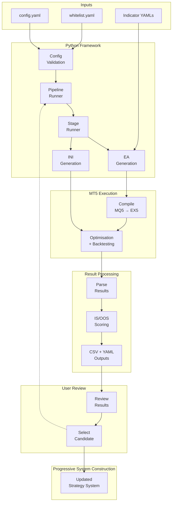

# MT5 Strategy Factory — Architecture Document

## Overview

MT5 Strategy Factory is a Python-based workflow automation framework for constructing, optimising, evaluating, and progressively assembling modular strategy systems.

The framework uses a staged processing model in which individual system components are independently evaluated and then combined into increasingly complete systems.

Although the domain is quantitative strategy research, the primary engineering focus is on:

- workflow orchestration
- configuration-driven behaviour
- code generation
- external process automation
- structured output generation
- reproducible processing pipelines

---

# Design Goals

The system was designed around several key goals:

### Reproducibility

Experiments should be repeatable and driven by configuration rather than hardcoded logic.

### Separation of Concerns

Individual processing stages should remain isolated and independently maintainable.

### Extensibility

New pipelines and processing stages should be introduced with minimal modification to existing code.

### Automation

Manual execution should be minimised wherever practical.

### Flexibility

Different indicators and optimisation workflows should be supported through reusable templates and configuration files.

---

# High-Level System Architecture

A key focus of this project was designing a staged processing pipeline capable of progressively constructing and evaluating systems while maintaining repeatable workflows.


---

# Processing Pipeline

The currently implemented workflow uses progressive staged construction:

```text
Trigger
    ↓
Confirmation
    ↓
Trendline
    ↓
Volume
    ↓
Exit
```

Each stage independently:

1. Loads indicator definitions
2. Generates source code
3. Compiles generated files
4. Creates MT5 configurations
5. Executes optimisation
6. Parses results
7. Scores candidates
8. Produces outputs
9. Passes selected results downstream

---

# Component Breakdown

## 1. Configuration System

Primary responsibilities:

- Load YAML configuration
- Validate required fields
- Define optimisation settings
- Define testing periods
- Define stage parameters

Inputs:

```yaml
run_name: example_run

pipeline: trend_following

start_date: 2016.01.01
end_date: 2020.01.01

risk: 2
```

Design rationale:

Configuration-driven behaviour avoids hardcoded logic and improves repeatability.

Benefits:

- Easy experimentation
- Reduced code changes
- Improved maintainability

---

## 2. Pipeline Runner

Primary responsibilities:

- Initialise pipeline execution
- Execute stages sequentially
- Coordinate stage handoffs

Design rationale:

Separate workflow control from stage implementation.

Benefits:

- Simpler orchestration logic
- Reusable pipelines

---

## 3. Stage Runner

Primary responsibilities:

- Create output structure
- Generate files
- Trigger processing
- Manage execution lifecycle

Design rationale:

Encapsulate all stage-level processing.

Benefits:

- Reduced duplication
- Independent stage execution

---

## 4. Expert Advisor Generation

Primary responsibilities:

- Read indicator YAML
- Render templates
- Generate MQ5 source files
- Compile generated code

Design rationale:

Use template-based code generation rather than manually maintaining many EA variants.

Benefits:

- Reduced duplicated code
- Rapid generation of many candidates
- Easier maintenance

---

## 5. Initialisation File Generation

Primary responsibilities:

- Create MT5 strategy tester files
- Inject parameter ranges
- Configure optimisation settings

Design rationale:

Separate platform configuration from processing logic.

Benefits:

- Easier automation
- Reduced manual effort

---

## 6. MT5 Execution Layer

Primary responsibilities:

- Launch MT5 processes
- Execute tests
- Monitor completion

Design rationale:

Abstract platform interaction behind Python automation.

Benefits:

- Repeatable execution
- Reduced manual intervention

---

## 7. Result Processing

Primary responsibilities:

- Parse optimisation output
- Calculate metrics
- Score candidates
- Produce summaries

Outputs:

- scored_results.csv
- best_summary.csv

Design rationale:

Separate evaluation logic from execution logic.

Benefits:

- Easier maintenance
- Flexible metrics

---

# Output Structure

Example:

```text
Outputs/

└── Apollo/

    ├── Trigger/
    │   ├── experts/
    │   ├── ini_files/
    │   ├── results/
    │   └── logs/

    ├── Confirmation/

    ├── Trendline/

    ├── Volume/

    └── Exit/
```

---

# Key Design Decisions

## Why YAML?

YAML allows:

- separation of configuration from code
- simpler experimentation
- reusable definitions

---

## Why staged processing?

Benefits:

- independent optimisation
- simpler debugging
- clearer responsibility boundaries

---

## Why template-based generation?

Benefits:

- avoid duplicated code
- support many combinations
- maintain consistency

---

## Why user selection between stages?

Benefits:

- allows domain expertise
- prevents blind automation
- enables human oversight

---

# Current Limitations

Current limitations include:

- limited automated test coverage
- manual candidate progression
- local MT5 dependency
- Windows-specific execution assumptions
- no distributed execution

---

# Future Improvements

Planned improvements:

- expanded testing
- improved visualisation
- dashboard reporting
- walk-forward workflows
- distributed execution
- improved pipeline abstraction
