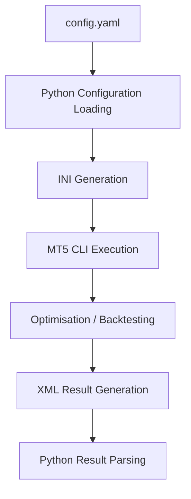
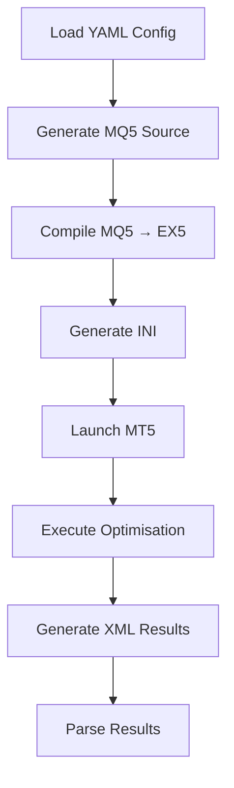

# MT5 Strategy Factory — MT5 Integration

## Overview

MT5 Strategy Factory interacts with MetaTrader 5 (MT5) through automatically generated strategy tester initialisation (`.ini`) files.

The framework abstracts MT5 execution behind Python automation, allowing strategy generation, optimisation, and evaluation workflows to be executed programmatically.

The generated `.ini` files remove the need for manual MT5 setup and support repeatable processing workflows.

Primary responsibilities:

- Translate Python configuration into MT5 settings
- Generate executable `.ini` files
- Launch MT5 through CLI automation
- Execute optimisation and backtesting
- Collect generated outputs
- Return results to Python for processing

---

# Integration Goals

The MT5 interaction layer was designed to provide:

- Repeatable execution
- Reduced manual setup
- Automated optimisation workflows
- External process orchestration
- Structured output generation
- Configuration-driven behaviour

---

# Integration Workflow



---

# Generated MT5 Initialisation Files

MT5 Strategy Factory generates `.ini` files automatically for each optimisation or backtest run.

These files define:

- Expert Advisor
- Symbols
- Timeframes
- Date ranges
- Optimisation mode
- Account configuration
- Parameter ranges

Example:

```ini
[Tester]

Expert=EA_MACD.ex5

Symbol=EURUSD

Period=D1

Model=0

Optimization=1

FromDate=2016.01.01

ToDate=2020.01.01

Deposit=100000

Leverage=100
```

---

# Configuration Translation

Python configuration values are translated into MT5 parameters.

Examples:

| Python Configuration | MT5 Setting |
|----------------------|-------------|
| `period` | `Period` |
| `start_date` | `FromDate` |
| `end_date` | `ToDate` |
| `deposit` | `Deposit` |
| `leverage` | `Leverage` |
| `main_chart_symbol` | `Symbol` |

---

# Generated File Lifecycle

Each stage follows:



---

# Example Generated Structure

Example:

```text
Outputs/

└── Apollo/

    └── Trigger/

        ├── experts/
        │      EA_MACD.ex5
        │
        ├── ini_files/
        │      MACD.ini
        │
        ├── logs/
        │
        └── results/
```

---

# Failure Handling

Common failure scenarios:

| Failure | Cause |
|-----------|--------|
| Missing EX5 file | MQ5 compilation failure |
| Missing XML output | MT5 execution failure |
| Missing CSV summaries | Result parsing failure |
| Empty optimisation results | Invalid parameters |

---

# Troubleshooting

## MT5 does not launch

Verify:

- MT5 installation exists
- CLI path configured correctly
- MT5 executable accessible

---

## Missing optimisation results

Verify:

- generated `.ini` exists
- symbols exist in MT5
- date ranges valid
- optimisation parameters valid

---

## Compilation errors

Review:

```text
Outputs/

    logs/
```

Check:

- generated MQ5 source
- indicator definitions
- parameter values

---

# Design Rationale

The MT5 integration layer abstracts platform interaction behind Python automation.

Benefits:

- Reduced manual effort
- Repeatable execution
- Batch optimisation support
- Easier experimentation
- Simplified workflow orchestration
- Separation between business logic and platform interaction

---

# Software Engineering Skills Demonstrated

This integration layer demonstrates:

- External process orchestration
- Configuration-driven behaviour
- File generation workflows
- Automation design
- CLI integration
- Result processing pipelines
- Workflow abstraction
- Modular architecture
