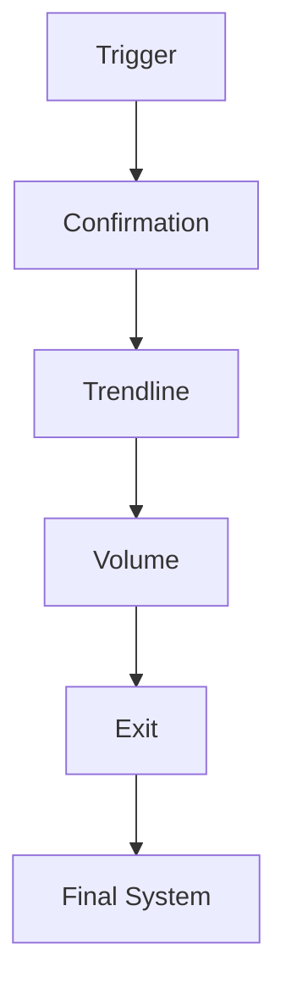
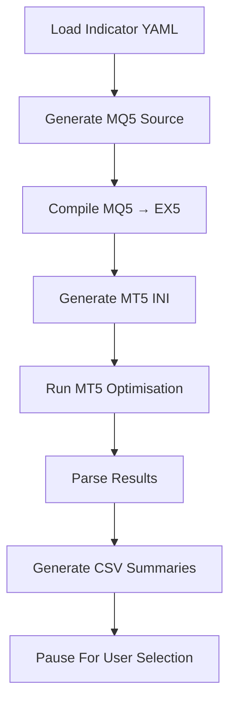

# MT5 Strategy Factory — Pipeline Workflow

## Overview

MT5 Strategy Factory uses a staged processing pipeline to progressively build complete trading systems.

Rather than generating a full strategy immediately, the framework evaluates and selects individual system components independently before combining them into a larger system.

The currently implemented pipeline follows a trend-following architecture.

High-level workflow:

```text
Trigger
    ↓
Confirmation
    ↓
Trendline
    ↓
Volume
    ↓
Exit
```

Each stage:

1. Loads indicator definitions
2. Generates Expert Advisors (EAs)
3. Compiles generated source code
4. Executes MT5 optimisation
5. Parses results
6. Scores candidates
7. Produces structured outputs
8. Waits for user selection
9. Passes the selected component downstream

---

# Why Use Staged Processing?

Instead of evaluating every possible combination simultaneously:

```text
Trigger × Confirmation × Trendline × Volume × Exit
```

The framework progressively reduces complexity by independently evaluating stages.

Benefits:

✅ Reduced optimisation workload

✅ Smaller search space

✅ Easier debugging

✅ Easier experimentation

✅ Modular architecture

✅ Incremental system construction

---

# Pipeline Architecture



---

# Stage Definitions

## Trigger

### Purpose

The trigger stage generates the primary signal used to identify potential trade opportunities.

Typical examples:

- MACD crossover
- RSI threshold
- Moving average crossover
- Oscillator signals

Questions answered:

> Should a trade potentially be opened?

---

## Confirmation

### Purpose

Confirmation adds additional validation to trigger signals.

Its role is to reduce false positives and improve trade quality.

Typical examples:

- Stochastic confirmation
- Momentum agreement
- Trend strength indicators

Questions answered:

> Does another signal agree?

---

## Trendline

### Purpose

Trendline determines broader market direction.

The intention is to align trades with larger market trends.

Typical examples:

- EMA
- ALMA
- Hull MA
- Adaptive moving averages

Questions answered:

> Is the market trending in the same direction?

---

## Volume

### Purpose

Volume acts as a market quality filter.

This stage attempts to avoid weak or unsuitable conditions.

Typical examples:

- Volatility filters
- Tick volume indicators
- Momentum strength filters
- Market activity measures

Questions answered:

> Is the current market environment suitable?

---

## Exit

### Purpose

Exit defines how trades are closed.

This stage controls both profit-taking and risk management behaviour.

Typical examples:

- ATR exits
- Trailing stops
- Fixed stop loss
- Fixed take profit
- Dynamic exits

Questions answered:

> When should the trade close?

---

# Stage Execution Lifecycle

Each stage executes the same general process:



---

# Optimisation Workflow

Each generated Expert Advisor executes:

```text
IS Optimisation
        ↓
IS Backtest
        ↓
OOS Evaluation
        ↓
OOS Backtest
        ↓
Score Results
```

Definitions:

| Term | Description |
|-------|-------------|
| IS | In-sample optimisation period |
| OOS | Out-of-sample validation period |

Purpose:

Reduce overfitting and improve robustness.

---

# Manual Candidate Selection

Following completion of a stage:

Review:

```text
best_summary.csv

scored_results.csv
```

Select the preferred indicator:

```bash
python -m strategy_factory.post_processing.make_stage_result_file \
--indicator MACD \
--stage Trigger
```

This generates:

```text
Outputs/

└── Example_Run/

    └── Trigger/

        └── results/

            the_trigger.yaml
```

The generated YAML becomes the selected component for the next stage.

---

# Example Pipeline Progression

Example:

```text
Trigger:
    MACD

Confirmation:
    Stochastic

Trendline:
    ALMA

Volume:
    MFI

Exit:
    ATR Trailing Exit
```

Result:

```text
Final System

MACD
    +
Stochastic
    +
ALMA
    +
MFI
    +
ATR Exit
```

---

# Design Rationale

The pipeline uses staged construction because it:

- reduces optimisation complexity
- supports modular system design
- improves maintainability
- enables experimentation
- reduces computational workload
- allows human oversight during progression
